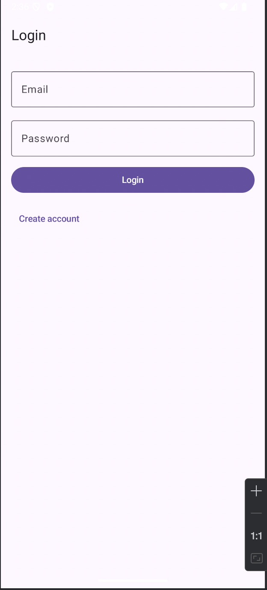
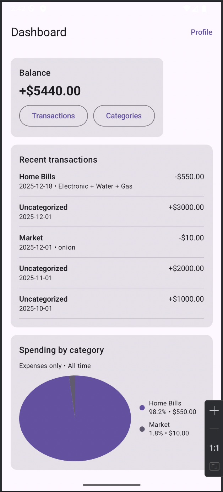
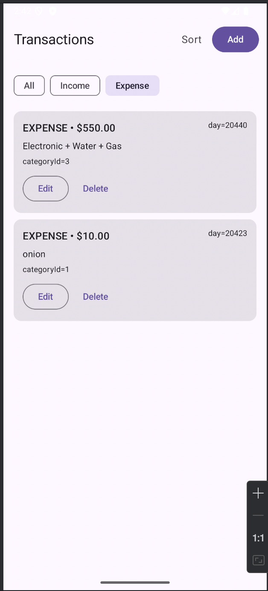
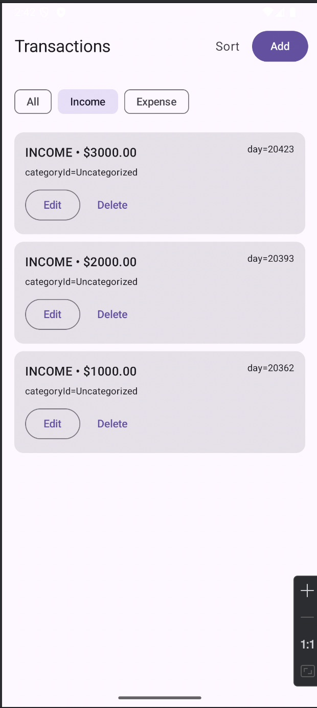
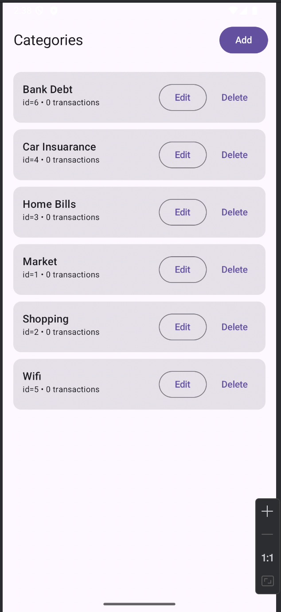
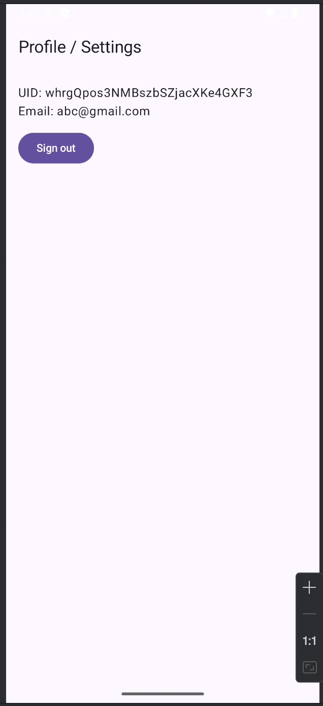

# Project: Personal Finance Tracker 

## Overview
**Personal Finance Tracker** app helps users track **income and expenses**, organize spending with **categories**, and view quick insights on a **Dashboard** (balance, recent transactions, and spending breakdown by category with a pie chart).

Built with **Jetpack Compose** and **Room Database**, and secured with **Firebase Email/Password Authentication**.

---

## What This Project Satisfies

### 1) Authentication (Firebase Email/Password)
- ✅ Email/Password **Sign Up** and **Login**
- ✅ **Persistent login** (user stays logged in after app restart)
- ✅ **Auth state management** via `AuthViewModel`
- ✅ **Protected routes** (auth graph vs main graph)
- ✅ **Sign out** from Profile/Settings
- ✅ **Validation**
  - Email format validation
  - Password minimum length (≥ 6)
- ✅ **Loading + error handling**
  - Loading indicators during auth actions
  - User-friendly error messages

### 2) Data Persistence (Room Database)
- ✅ Local persistence using **Room**
- ✅ **Two related entities** with relationships:
  - `Transaction`
  - `Category`
- ✅ Full CRUD:
  - Transactions: Create / Read / Update / Delete
  - Categories: Create / Read / Update / Delete
- ✅ Reactive updates using **Flow** (UI updates automatically when DB changes)

### 3) UI with Jetpack Compose
- ✅ Built with **Material 3** components & consistent styling
- ✅ Navigation using **Navigation Component (Compose)**
- ✅ App includes **functional screens (6–8+)**:
  - Login
  - Sign Up
  - Dashboard (Home)
  - Transactions List
  - Add/Edit Transaction
  - Categories Management as well as add/edit Categories
  - Profile/Settings (Sign out)

### 4) Architecture
- ✅ **MVVM** separation of concerns
- ✅ **Repository pattern**
- ✅ **StateFlow / Flow** for state management + reactive UI
- ✅ **Coroutines** for async work

---

## Functional Screens (Screenshots)

### 1) Login Screen

### 2) Sign Up Screen

### 3) Dashboard (Balance + Recent + Spending Pie Chart)

### 4) Transactions Expenses List Screen

### 5) Transaction Income List Screen

### 6) Categories Management Screen (CRUD)

### 8) Profile / Settings Screen (Sign Out)

---

## Using-Tech List:
- **Kotlin**
- **Jetpack Compose**
- **Navigation Compose**
- **Room Database**
- **Firebase Authentication (Email/Password)**
- **Coroutines + Flow/StateFlow**

---
